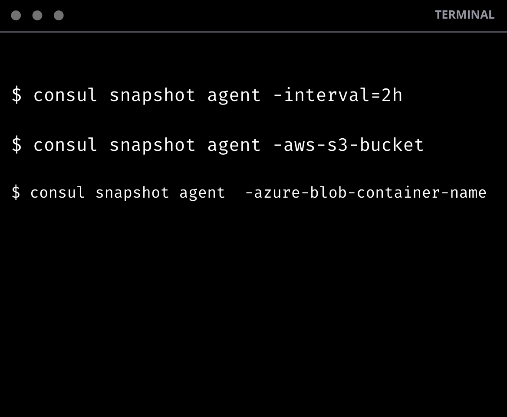

name: Chapter-3
class: title
# Chapter 3
## Consul Enterprise - Platform

---
name: Platform-Overview
Consul Enterprise - Platform
-------------------------
Consul Enterprise Platform provides operational features to improve platform reliability.

---
name: Platform-Automated-Backups
class: img-right compact
Consul Enterprise Platform - Automated Backups
-------------------------
.center[]

Consul Enterprise enables you to run the snapshot agent within your environment as a service.  The snapshot agent service operates as a highly available process that integrates with the snapshot API to automatically manage taking snapshots, backup rotation, and sending backup files.

This capability provides an enterprise solution for backup and restoring the state of Consul servers within an environment in an automated manner. These snapshots are atomic and point-in-time, fully managed, and highly available.

---
name: Platform-Automated-Upgrades
Consul Enterprise Platform - Automated Upgrades
-------------------------

Consul Enterprise enables the capability of automatically upgrading a cluster of Consul servers to a new version as updated server nodes join the cluster. This automated upgrade will spawn a process which monitors the amount of voting members currently in a cluster.

Demotion of legacy server nodes will not occur until the voting members on the new version match. Once this demotion occurs, the previous versioned servers can be removed from the cluster safely.

---
name: Consul-Enterprise-Platform-Lab
# 👩‍💻 Lab Exercise: Shared Service Continuity
  
In this lab you'll perform the following tasks:
  * Provision VPCs
  * Build Immutable Consul Images
  * Provision & Bootstrap Consul ASGs
  * Validate Automatic Migrations
  * Validate Automatic Backups
  * Centralize Consul Secrets in Vault

Your instructor will provide the URL for the lab environment.

🛑 **STOP** after you complete the first quiz.
