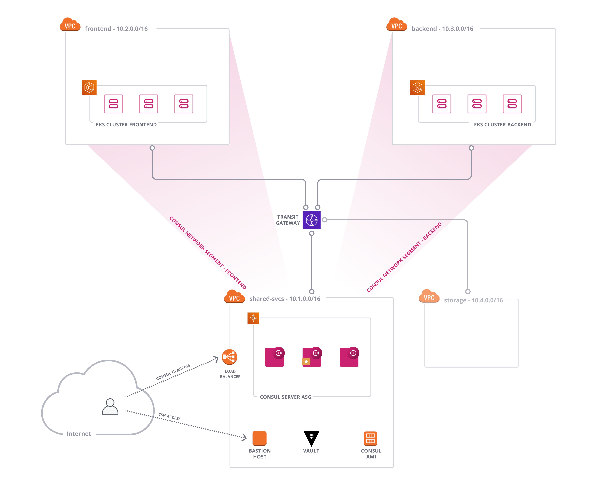
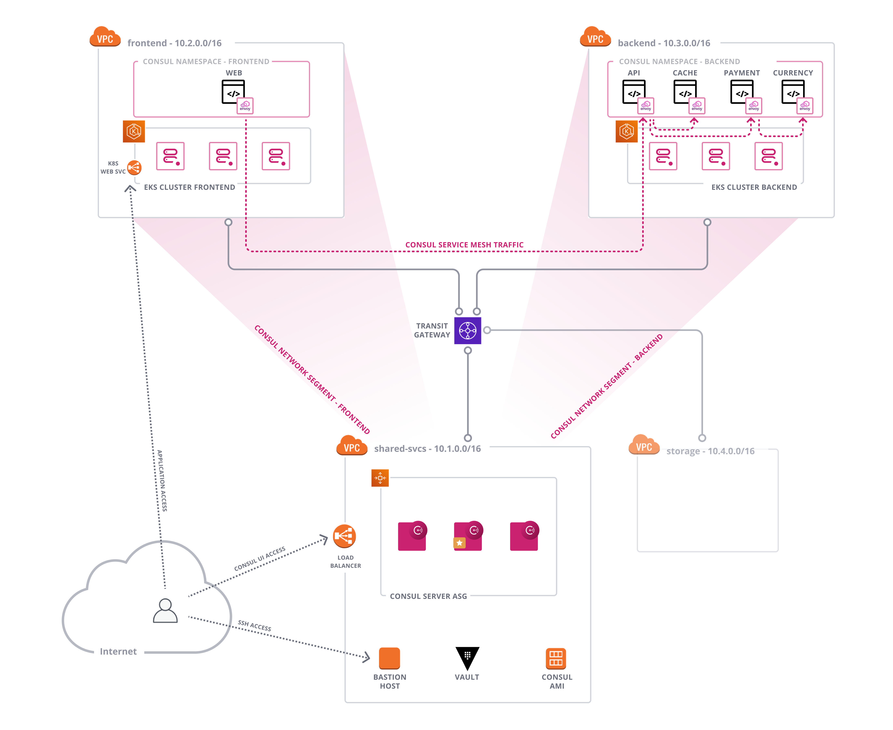

name: Chapter-4
class: title
# Chapter 4
## Consul Enterprise  - Governance and Policy

---
name: Consul-Enterprise-Governance-Policy
class: img-right
Consul Enterprise - Governance and Policy (before)
-------------------------
.center[]

Consul Enterprise Governance and Policy supports multi-tenancy and Policy as Code.

You will use this module to enable self-service networking workflows.

---
name: Consul-Enterprise-Governance-Policy
class: img-right
Consul Enterprise - Governance and Policy (after)
-------------------------
.center[]

The application will be deployed across the frontend and backend application EKS clusters.

Consul Namespaces will allow for developers to own connectivity between services they deploy, and selectively allow other teams to connect into their namespace.

---
name: Consul-Enterprise-Governance-Policy-Lab
# 👩‍💻 Lab Exercise: Self-Service Workflows
In this lab you'll perform the following tasks:
  * Create Consul Namespaces and Policies
  * Create Consul Roles in Vault
  * Configure Secrets for EKS clusters
  * Deploy Consul on EKS
  * Deploy applications
  * Configure Intentions

Your instructor will provide the URL for the lab environment.

🛑 **STOP** after you complete the first quiz.
